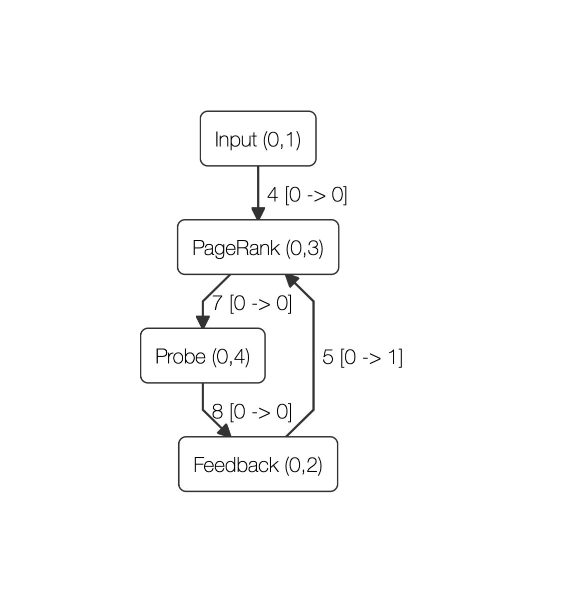

# Timely Diagnostics

Diagnostic tools for [timely
dataflow](https://github.com/TimelyDataflow/timely-dataflow)
computations. Timely dataflows are data-parallel and scale from single
threaded execution on your laptop to distributed execution across
clusters of computers. Each thread of execution is called a *worker*.

The tools in this repository have the shared goal of providing
insights into timely dataflows of any scale, in order to understand
the structure and resource usage of a dataflow.

Each timely worker can be instructed to publish low-level event
streams over a TCP socket, by setting the `TIMELY_WORKER_LOG_ADDR`
environment variable. In order to cope with the high volume of
these logging streams the diagnostic tools in this repository
are themselves timely computations that we can scale out. In order to avoid
confusion, we will refer to the workers of the dataflow *that is being
analysed* as the `source peers`. The workers of the diagnostic
computation we will refer to as `inspector
peers`.

This repository contains a library, `tdiag-connect`, and a command
line interface to the diagnostic tools, `tdiag`.

`tdiag-connect` (in [`/connect`](./connect)) is a library of utiltities that can
be used by inspector peers to source event streams from source peers.

`tdiag` (in [/tdiag](./tdiag)) is an unified command line interface to all diagnostic
tools (only one is currently available, more are coming).

## Getting Started with `tdiag`

`tdiag` [](https://crates.io/crates/tdiag) is the CLI to all diagnostic tools. Install it via cargo: 

``` shell
cargo install tdiag
```

All diagnostic computations require you to specify the number of
workers running in the source computation via the `source-peers`
parameter. This is required in order to know when all source event
streams are connected.

### `graph` - Visualize the Source Dataflow

In order to better understand what is happening inside of a dataflow
computation, it can be invaluable to visualize the structure of the
dataflow. Start the `graph` diagnosis:

``` shell
tdiag --source-peers 2 graph --out graph.html
```

You should be presented with a notice, informing you that `tdiag` is
waiting for as many connections as specified via `--source-peers` (two
in this case).

In a separate shell, start your source computation. In this case, we
will analyse the [Timely PageRank
example](https://github.com/TimelyDataflow/timely-dataflow/blob/master/timely/examples/pagerank.rs). From
inside the `timely-dataflow/timely` sub-directory, run:

``` shell
env TIMELY_WORKER_LOG_ADDR="127.0.0.1:51317" cargo run --example pagerank 1000 1000000 -w 2
```

Most importantly, `env TIMELY_WORKER_LOG_ADDR="127.0.0.1:51317"` will
cause the source workers to connect to our diagnostic computation. The
`-w` parameter specifies the number of workers we want to run the
PageRank example with. Whatever we specify here therefore has to match
the `--source-peers` parameter we used when starting `tdiag`.

Once the computation is running, head back to the diagnostic shell,
where you should now see something like the following:

``` shell
$ tdiag --source-peers 2 graph --out graph.html

Listening for 2 connections on 127.0.0.1:51317
Trace sources connected
Press enter to generate graph (this will crash the source computation if it hasn't terminated).
```

At any point, press enter as instructed. This will produce a fully
self-contained HTML file at the path specified via `--out`
(`graph.html` in this example). Open that file in any modern browser
and you should see a rendering of the dataflow graph at the time you
pressed enter. For the PageRank computation, the rendering should look
similar to the following:



You can use your mouse or touchpad to move the graph around, and to
zoom in and out.

### `profile` - Profile the Source Dataflow

The `profile` subcommand reports aggregate runtime for each scope/operator.

```shell
tdiag --source-peers profile
```

You should be presented with a notice informing you that `tdiag` is
waiting for as many connections as specified via `--source-peers` (two
in this case).

In a separate shell, start your source computation. In this case, we
will analyse the [Timely PageRank
example](https://github.com/TimelyDataflow/timely-dataflow/blob/master/timely/examples/pagerank.rs). From
inside the `timely-dataflow/timely` sub-directory, run:

``` shell
env TIMELY_WORKER_LOG_ADDR="127.0.0.1:51317" cargo run --example pagerank 1000 1000000 -w 2
```

Most importantly, `env TIMELY_WORKER_LOG_ADDR="127.0.0.1:51317"` will
cause the source workers to connect to our diagnostic computation. The
`-w` parameter specifies the number of workers we want to run the
PageRank example with. Whatever we specify here therefore has to match
the `--source-peers` parameter we used when starting `tdiag`.

Once the computation is running, head back to the diagnostic shell,
where you should now see something like the following:

```shell
$ tdiag --source-peers 2 profile

Listening for 2 connections on 127.0.0.1:51317
Trace sources connected
Press enter to stop collecting profile data (this will crash the source computation if it hasn't terminated).
```

At any point, press enter as instructed. This will produce an aggregate
summary of runtime for each scope/operator. Note that the aggregates for the
scopes (denoted by `[scope]`) include the time of all contained operators.

```shell
[scope]	Dataflow	(id=0, addr=[0]):	1.17870668e-1 s
	PageRank	(id=3, addr=[0, 3]):	1.17197194e-1 s
	Feedback	(id=2, addr=[0, 2]):	3.56249e-4 s
	Probe	(id=6, addr=[0, 4]):	7.86e-6 s
	Input	(id=1, addr=[0, 1]):	3.408e-6 s
```

## Diagnosing Differential Dataflows

The `differential` subcommand groups diagnostic tools that are only
relevant to timely dataflows that make use of [differential
dataflow](https://github.com/TimelyDataflow/differential-dataflow). To
enable Differential logging in your own computation, add the following
snippet to your code:

``` rust
if let Ok(addr) = ::std::env::var("DIFFERENTIAL_LOG_ADDR") {
    if let Ok(stream) = ::std::net::TcpStream::connect(&addr) {
        differential_dataflow::logging::enable(worker, stream);
        info!("enabled DIFFERENTIAL logging to {}", addr);
    } else {
        panic!("Could not connect to differential log address: {:?}", addr);
    }
}
```

With this snippet included in your executable, you can use any of the
following tools to analyse differential-specific aspects of your
computation.

### `differential arrangements` - Track the Size of Differential Arrangements

Stateful differential dataflow operators often maintain indexed input
traces called `arrangements`. You will want to understand how these
traces grow (through the accumulation of new inputs) and shrink
(through compaction) in size, as your computation executes.

```shell
tdiag --source-peers differential arrangements
```

You should be presented with a notice informing you that `tdiag` is
waiting for as many connections as specified via `--source-peers` (two
in this case).

In a separate shell, start your source computation. In this case, we
will analyse the [Differential BFS
example](https://github.com/TimelyDataflow/differential-dataflow/blob/master/examples/bfs.rs). From
inside the differential dataflow repository, run:

``` shell
export TIMELY_WORKER_LOG_ADDR="127.0.0.1:51317"
export DIFFERENTIAL_LOG_ADDR="127.0.0.1:51318"

cargo run --example bfs 1000 10000 100 20 false -w 2
```

When analysing differential dataflows (in contrast to pure timely
computations), both `TIMELY_WORKER_LOG_ADDR` and
`DIFFERENTIAL_LOG_ADDR` must be set for the source workers to connect
to our diagnostic computation. The `-w` parameter specifies the number
of workers we want to run the PageRank example with. Whatever we
specify here therefore has to match the `--source-peers` parameter we
used when starting `tdiag`.

Once the computation is running, head back to the diagnostic shell,
where you should now see something like the following:

```shell
$ tdiag --source-peers 2 differential arrangements

Listening for 2 Timely connections on 127.0.0.1:51317
Listening for 2 Differential connections on 127.0.0.1:51318
Trace sources connected
(((0, 18), (649, "Arrange ([0, 4, 6])")), 1s, 1)
(((0, 20), (5944, "Arrange ([0, 4, 7])")), 1s, 1)
(((0, 28), (3763, "Arrange ([0, 4, 10])")), 1s, 1)
(((0, 30), (651, "Reduce ([0, 4, 11])")), 1s, 1)
(((1, 18), (676, "Arrange ([0, 4, 6])")), 1s, 1)
(((1, 20), (6006, "Arrange ([0, 4, 7])")), 1s, 1)
(((1, 28), (3889, "Arrange ([0, 4, 10])")), 1s, 1)
(((1, 30), (678, "Reduce ([0, 4, 11])")), 1s, 1)
(((0, 18), (649, "Arrange ([0, 4, 6])")), 2s, -1)
```

An output tuple such as `(((1, 20), (6006, "Arrange ([0, 4, 7])")),
1s, 1)` should be read as "Arrangement 20 ('Arrange ([0, 4, 7])') at
worker 1 contains 6006 tuples". Updated sizes will be reported every
second.

## The `tdiag-connect` library

[](https://crates.io/crates/tdiag-connect) [](https://docs.rs/tdiag-connect)

`tdiag-connect` (in [`/connect`](./connect)) is a library of utiltities that can
be used by inspector peers to source event streams from source peers.

Documentation is at [docs.rs/tdiag-connect](https://docs.rs/tdiag-connect).
